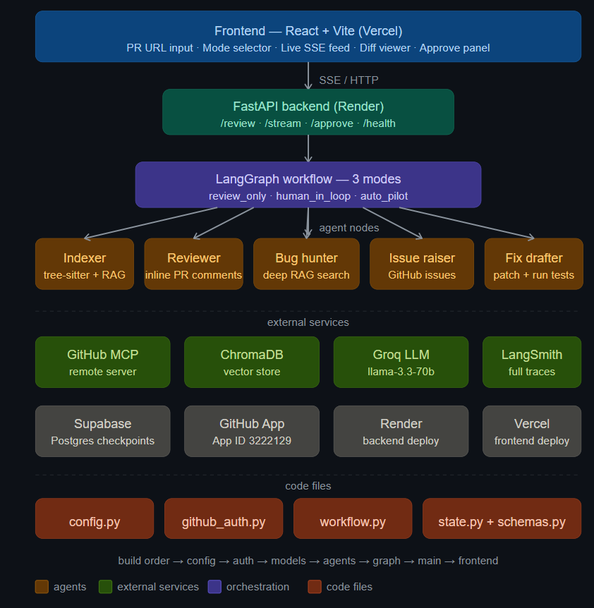

# Smart PR Review Agent
## Architecture
## Architecture

```

FastAPI backend with LangGraph workflow, GitHub App integration, and a Vite + React UI.

Smart PR review that streams agent progress via SSE and can pause for human approval before drafting and testing fixes.

## Setup
1. Copy `.env.example` to `.env` and set these values:
   - `GROQ_API_KEY`
   - `GITHUB_PRIVATE_KEY` (PEM)
   - `GITHUB_WEBHOOK_SECRET`
   - `DATABASE_URL`
   - `LANGCHAIN_API_KEY`
2. Backend:
   - `pip install -r requirements.txt`
   - `uvicorn backend.main:app --reload --host 127.0.0.1 --port 8000`
3. Frontend:
   - `cd frontend`
   - `npm install`
   - `npm run dev`

## API
| Method | Path | Description |
|---|---|---|
| `GET` | `/health` | Health + graph readiness |
| `POST` | `/review` | Starts a review workflow (returns `thread_id`) |
| `GET` | `/stream/{thread_id}` | SSE stream of agent step events |
| `POST` | `/approve` | Approve/reject in `human_in_loop` mode |
| `POST` | `/webhook` | GitHub webhook trigger for PR events |

## Architecture

```mermaid
flowchart TD
  User[User] --> Frontend[Frontend React UI]
  Frontend -->|POST /review| API[FastAPI backend]
  API -->|thread_id| LangGraph[LangGraph workflow]
  LangGraph --> Indexer[Index repository + tree-sitter chunks]
  Indexer --> Chroma[Chroma vector store]
  LangGraph --> Reviewer[Groq PR review + confidence]
  Reviewer -->|low confidence| BugHunter[Groq bug hunting]
  BugHunter --> IssueRaiser[Create GitHub issues]
  IssueRaiser --> Human[Interrupt for human approval]
  Human -->|approved| FixDraft[Groq patch draft + apply + tests]
  Human -->|rejected| End[Stop]
  FixDraft --> Frontend
  API -->|GET /stream/{thread_id}| FrontendStream[SSE events]
```

## Deploy

### Backend (Render)
1. Use `render.yaml` for the `smart-pr-review-bot-api` service.
2. Set Render environment variables matching `.env.example`.
3. Start command is `uvicorn backend.main:app --host 0.0.0.0 --port $PORT`.

### Frontend (Vercel)
1. Use `vercel.json` to build from `frontend/` into `frontend/dist`.
2. SPA routing rewrites all routes to `index.html`.

## Demo

Replace `./docs/demo.gif` with your demo animation.
