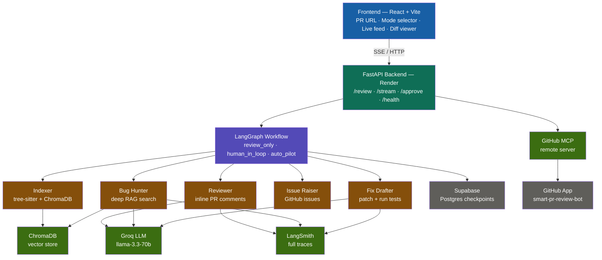

# Smart PR Review Agent
## Architecture

FastAPI backend with LangGraph workflow, GitHub integration, and a Vite + React UI.

## Setup

1. Copy `.env.example` to `.env` and set `OPENAI_API_KEY`, `GITHUB_TOKEN`, and GitHub app fields.
2. Backend: install `requirements.txt`, set `PYTHONPATH` to the repo root, run `uvicorn backend.main:app --reload --host 127.0.0.1 --port 8000`.
3. Frontend: `cd frontend`, `npm install`, `npm run dev` (proxies API to port 8000).

## API

- `GET /health`
- `POST /review`
- `GET /stream/{thread_id}` (SSE)
- `POST /approve`
